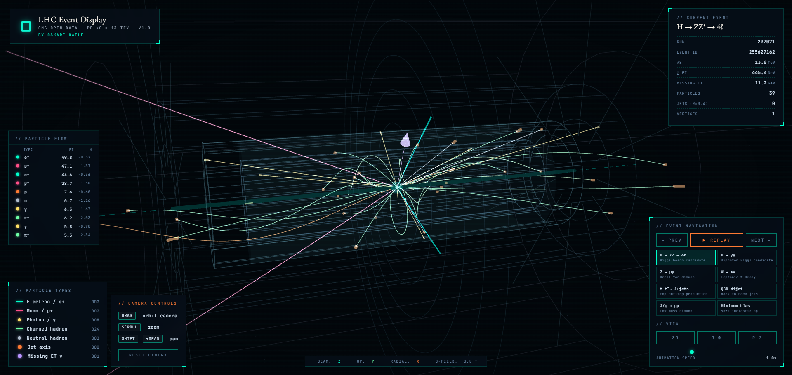

# LHC Event Display — Particle Collision Visualizer

**[Live demo →](https://oskarikaile.github.io/Particle_collision_visualizer/)**

An interactive 3D particle collision visualizer rendered in the browser. Explore 8 physics-inspired LHC event types — from Higgs boson candidates to QCD dijets — with animated tracks, calorimeter deposits, and missing transverse energy, all modelled on real CMS Open Data from CERN pp collisions at √s = 13 TeV.




> Built by [Oskari Kaile](https://oskarikaile.github.io/)

---

## Features

- **8 LHC event types** — H → ZZ → 4ℓ, H → γγ, Z → μμ, W → eν, tt̄ → ℓ+jets, QCD dijet, J/ψ → μμ, minimum bias
- **Animated track drawing** — helical tracks for charged particles in a 3.8 T solenoidal field, straight lines for neutrals
- **Calorimeter deposits** — EM and hadronic tower hits rendered at the detector surface
- **Jet cones** — anti-kT R=0.4 jet axes with proportional cone geometry
- **Missing ET arrow** — dashed vector for neutrino-like invisible momentum
- **Detector geometry** — layered wireframe of tracker, ECAL, HCAL, solenoid, and muon system
- **3 projection views** — 3D orbit, r-φ transverse, r-z longitudinal
- **Particle type filtering** — click the legend to toggle individual particle species
- **Particle flow panel** — live list of the highest-pT particles with hover tooltips
- **Animation speed control** — adjustable replay rate via slider
- **No build step** — single HTML + JS, Three.js loaded from CDN

---

## Controls

| Input | Action |
|---|---|
| `Drag` | Orbit camera |
| `Scroll` | Zoom in / out |
| `Shift` + `Drag` | Pan |
| `Prev / Next` | Browse event types |
| `Replay` | Re-animate current event |
| `3D / r-φ / r-z` | Switch projection view |
| `Speed slider` | Adjust animation speed |
| `Click` legend item | Toggle particle type visibility |
| `Hover` particle row | Show pT, η, φ, energy, charge |
| `Reset Camera` | Return to default viewpoint |

---

## Event types

| Label | Description |
|---|---|
| H → ZZ → 4ℓ | Higgs boson candidate, golden channel (mH ≈ 125 GeV) |
| H → γγ | Diphoton resonance (mH ≈ 125 GeV) |
| Z → μμ | Drell-Yan dimuon (mZ ≈ 91 GeV) |
| W → eν | Single lepton + large missing ET |
| tt̄ → ℓ+jets | Semileptonic top-antitop with 4 jets |
| QCD dijet | Hard-scattered partons → back-to-back hadronic jets |
| J/ψ → μμ | Low-pT dimuon resonance (m ≈ 3.1 GeV) |
| Minimum bias | Soft inelastic pp scattering |

---

## Tech

- [Three.js](https://threejs.org/) r128 — WebGL rendering via CDN
- Physics modelling based on [CERN CMS Open Data](https://opendata.cern.ch/) (Run 2, √s = 13 TeV)
- Helical track propagation in a uniform 3.8 T solenoidal field
- Custom orbit camera — no OrbitControls dependency
- Vanilla JS, no framework, no bundler

---

## Project structure

```
├── index.html     # Shell, HUD markup, panel layout
├── styles.css     # All styles — observatory aesthetic
├── main.js        # Three.js scene, physics generators, animation loop
└── assets/
    ├── O-logo.png # Logo
    └── O.png      # Mini logo
```

---

## Physics notes

Charged particle trajectories are computed as helices in a uniform axial magnetic field (B = 3.8 T). The helix radius is derived from transverse momentum: R = pT / (0.3 · B). Neutral particles travel in straight lines. Calorimeter towers appear at the ECAL (r ≈ 1.29–1.77 m) and HCAL (r ≈ 1.77–2.95 m) surfaces, with tower height proportional to deposited energy.

---

## Running locally

No install needed — just open `index.html` directly in a browser, or serve over HTTP:

```bash
npx serve .
# or
python -m http.server 8000
```

Then open `http://localhost:8000`.

---

## License

MIT — see [LICENSE](LICENSE) for details.
